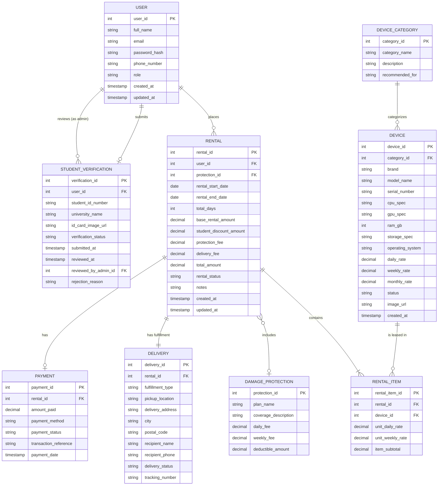

# Database Design Document
## TechLeasing Platform

---

## 1. Database Overview
This document specifies the relational database design for the **TechLeasing** web platform. TechLeasing facilitates short-term rentals and leases of high-end laptops and electronic devices to university students and professionals.

The database is designed according to the principles of relational database management systems (RDBMS) and is normalized to **Third Normal Form (3NF)** to eliminate data redundancy, maintain data consistency, and ensure referential integrity.

### Target RDBMS
- **Primary Production Target:** PostgreSQL 15+ / MySQL 8.0+
- **Development & Prototyping:** SQLite 3 / PostgreSQL
- **Character Encoding:** UTF-8 (`utf8mb4`)

---

## 2. Entity-Relationship (ER) Diagram

The following diagram illustrates the entities, key attributes, and cardinality relationships across the TechLeasing system:

---

## 3. Entity & Table Definitions

### 3.1 USER
Stores user account profiles, authentication data, and access privilege roles.

| Attribute Name | Data Type | PK | FK | Nullable | Description |
| :--- | :--- | :---: | :---: | :---: | :--- |
| `user_id` | `INT` | Yes | No | No | Unique surrogate identifier for each registered user. |
| `full_name` | `VARCHAR(100)` | No | No | No | User's full legal name. |
| `email` | `VARCHAR(100)` | No | No | No | Unique email address used for login and notifications. |
| `password_hash` | `VARCHAR(255)` | No | No | No | Secure salted hash of user's password (e.g., bcrypt). |
| `phone_number` | `VARCHAR(20)` | No | No | No | Contact telephone number for order updates. |
| `role` | `VARCHAR(20)` | No | No | No | User authorization role: `'Customer'`, `'Student'`, or `'Admin'`. |
| `created_at` | `TIMESTAMP` | No | No | No | Date and time the account was registered. |
| `updated_at` | `TIMESTAMP` | No | No | No | Date and time the account details were last updated. |

---

### 3.2 STUDENT_VERIFICATION
Stores student identification credentials and admin validation records for student discounts.

| Attribute Name | Data Type | PK | FK | Nullable | Description |
| :--- | :--- | :---: | :---: | :---: | :--- |
| `verification_id` | `INT` | Yes | No | No | Unique identifier for the verification request. |
| `user_id` | `INT` | No | Yes | No | References `USER(user_id)`. The student submitting proof. |
| `student_id_number`| `VARCHAR(30)` | No | No | No | Official student identification number. |
| `university_name` | `VARCHAR(100)` | No | No | No | Name of the higher education institution. |
| `id_card_image_url`| `VARCHAR(255)` | No | No | No | Path or URL to uploaded student ID image. |
| `verification_status`| `VARCHAR(20)`| No | No | No | Review status: `'Pending'`, `'Approved'`, or `'Rejected'`. |
| `submitted_at` | `TIMESTAMP` | No | No | No | Timestamp of initial document submission. |
| `reviewed_at` | `TIMESTAMP` | No | No | Yes | Timestamp when reviewed by an administrator. |
| `reviewed_by_admin_id`| `INT` | No | Yes | Yes | References `USER(user_id)`. Admin who reviewed the request. |
| `rejection_reason` | `VARCHAR(255)` | No | No | Yes | Optional explanation if verification was rejected. |

---

### 3.3 DEVICE_CATEGORY
Organizes electronic hardware into functional groupings based on compute workload.

| Attribute Name | Data Type | PK | FK | Nullable | Description |
| :--- | :--- | :---: | :---: | :---: | :--- |
| `category_id` | `INT` | Yes | No | No | Unique identifier for the category. |
| `category_name` | `VARCHAR(50)` | No | No | No | Category name (e.g., `'3D Animation & Rendering'`). |
| `description` | `TEXT` | No | No | Yes | Description of suitable computational workloads. |
| `recommended_for` | `VARCHAR(255)` | No | No | Yes | Target software tags (e.g., `'Blender, Maya, Unreal'`). |

---

### 3.4 DEVICE
Represents physical hardware inventory units available for short-term leasing.

| Attribute Name | Data Type | PK | FK | Nullable | Description |
| :--- | :--- | :---: | :---: | :---: | :--- |
| `device_id` | `INT` | Yes | No | No | Unique identifier for the physical device unit. |
| `category_id` | `INT` | No | Yes | No | References `DEVICE_CATEGORY(category_id)`. |
| `brand` | `VARCHAR(50)` | No | No | No | Manufacturer brand name (e.g., ASUS, Apple, Lenovo). |
| `model_name` | `VARCHAR(100)` | No | No | No | Hardware model name (e.g., ROG Zephyrus G16). |
| `serial_number` | `VARCHAR(50)` | No | No | No | Unique manufacturer hardware serial number. |
| `cpu_spec` | `VARCHAR(100)` | No | No | No | Processor description (e.g., Intel Core i9-13900H). |
| `gpu_spec` | `VARCHAR(100)` | No | No | No | Graphics processor spec (e.g., NVIDIA RTX 4070 8GB). |
| `ram_gb` | `INT` | No | No | No | System memory size in gigabytes (e.g., 32). |
| `storage_spec` | `VARCHAR(50)` | No | No | No | Solid-state drive capacity (e.g., '1TB NVMe SSD'). |
| `operating_system` | `VARCHAR(50)` | No | No | No | Installed OS (e.g., Windows 11 Pro, macOS). |
| `daily_rate` | `DECIMAL(10,2)`| No | No | No | Rental fee per day in THB. |
| `weekly_rate` | `DECIMAL(10,2)`| No | No | No | Discounted rental fee per week in THB. |
| `monthly_rate` | `DECIMAL(10,2)`| No | No | No | Discounted rental fee per 30 days in THB. |
| `status` | `VARCHAR(20)` | No | No | No | Status: `'Available'`, `'Rented'`, `'Maintenance'`, `'Retired'`. |
| `image_url` | `VARCHAR(255)` | No | No | Yes | Product showcase photo URL. |
| `created_at` | `TIMESTAMP` | No | No | No | Timestamp when device was added to catalog. |

---

### 3.5 DAMAGE_PROTECTION
Maintains protection coverage package plans to safeguard renters against accidental damage liability.

| Attribute Name | Data Type | PK | FK | Nullable | Description |
| :--- | :--- | :---: | :---: | :---: | :--- |
| `protection_id` | `INT` | Yes | No | No | Unique identifier for the damage protection tier. |
| `plan_name` | `VARCHAR(50)` | No | No | No | Plan title (e.g., `'Standard TechCare Protection'`). |
| `coverage_description`| `TEXT` | No | No | No | Coverage terms (accidental drops, liquid spills, faults). |
| `daily_fee` | `DECIMAL(10,2)`| No | No | No | Additional protection fee per day in THB. |
| `weekly_fee` | `DECIMAL(10,2)`| No | No | No | Additional protection fee per week in THB. |
| `deductible_amount` | `DECIMAL(10,2)`| No | No | No | Out-of-pocket customer deductible (0.00 for full cover). |

---

### 3.6 RENTAL
Represents a rental reservation agreement created by a user.

| Attribute Name | Data Type | PK | FK | Nullable | Description |
| :--- | :--- | :---: | :---: | :---: | :--- |
| `rental_id` | `INT` | Yes | No | No | Unique order/rental contract number. |
| `user_id` | `INT` | No | Yes | No | References `USER(user_id)`. The leasing customer. |
| `protection_id` | `INT` | No | Yes | Yes | References `DAMAGE_PROTECTION(protection_id)` (Optional). |
| `rental_start_date` | `DATE` | No | No | No | Scheduled commencement date of the lease. |
| `rental_end_date` | `DATE` | No | No | No | Scheduled return date of the lease. |
| `total_days` | `INT` | No | No | No | Total elapsed calendar rental days. |
| `base_rental_amount`| `DECIMAL(10,2)`| No | No | No | Base calculated hardware rental price. |
| `student_discount_amount`| `DECIMAL(10,2)`| No | No | No | Total discount applied for verified students. |
| `protection_fee` | `DECIMAL(10,2)`| No | No | No | Fee added if damage protection is chosen. |
| `delivery_fee` | `DECIMAL(10,2)`| No | No | No | Fee added if delivery is selected (0.00 for pickup). |
| `total_amount` | `DECIMAL(10,2)`| No | No | No | Net payable total in THB. |
| `rental_status` | `VARCHAR(20)` | No | No | No | Status: `'Pending'`, `'Confirmed'`, `'Active'`, `'Returned'`, `'Cancelled'`. |
| `notes` | `TEXT` | No | No | Yes | Special renter requests or handover notes. |
| `created_at` | `TIMESTAMP` | No | No | No | Timestamp when reservation was submitted. |
| `updated_at` | `TIMESTAMP` | No | No | No | Timestamp of latest state change. |

---

### 3.7 RENTAL_ITEM
Associative entity connecting rentals with specific devices, enabling a rental to contain one or more devices while snapshotting the agreed rate.

| Attribute Name | Data Type | PK | FK | Nullable | Description |
| :--- | :--- | :---: | :---: | :---: | :--- |
| `rental_item_id` | `INT` | Yes | No | No | Unique line-item identifier. |
| `rental_id` | `INT` | No | Yes | No | References `RENTAL(rental_id)`. Parent rental order. |
| `device_id` | `INT` | No | Yes | No | References `DEVICE(device_id)`. Leased device unit. |
| `unit_daily_rate` | `DECIMAL(10,2)`| No | No | No | Daily rate locked at the moment of booking. |
| `unit_weekly_rate`| `DECIMAL(10,2)`| No | No | No | Weekly rate locked at the moment of booking. |
| `item_subtotal` | `DECIMAL(10,2)`| No | No | No | Subtotal for this specific device line item. |

---

### 3.8 DELIVERY
Captures fulfillment logistics, distinguishing between store pickup and doorstep delivery.

| Attribute Name | Data Type | PK | FK | Nullable | Description |
| :--- | :--- | :---: | :---: | :---: | :--- |
| `delivery_id` | `INT` | Yes | No | No | Unique delivery/fulfillment record ID. |
| `rental_id` | `INT` | No | Yes | No | References `RENTAL(rental_id)` (Unique 1:1 relationship). |
| `fulfillment_type` | `VARCHAR(20)` | No | No | No | Mode: `'Store Pickup'` or `'Doorstep Delivery'`. |
| `pickup_location` | `VARCHAR(100)` | No | No | Yes | Campus depot name (if store pickup selected). |
| `delivery_address`| `VARCHAR(255)` | No | No | Yes | Destination street address (if delivery selected). |
| `city` | `VARCHAR(50)` | No | No | Yes | City or municipality name. |
| `postal_code` | `VARCHAR(10)` | No | No | Yes | Postal/Zip code. |
| `recipient_name` | `VARCHAR(100)` | No | No | No | Name of authorized recipient. |
| `recipient_phone`| `VARCHAR(20)` | No | No | No | Contact telephone number for courier. |
| `delivery_status` | `VARCHAR(20)` | No | No | No | Status: `'Pending Dispatch'`, `'Out for Delivery'`, `'Delivered'`, `'Ready for Pickup'`, `'Picked Up'`, `'Returned'`. |
| `tracking_number` | `VARCHAR(50)` | No | No | Yes | Courier shipping or dispatch tracking code. |

---

### 3.9 PAYMENT
Maintains transaction records and simulated payment status for rental orders.

| Attribute Name | Data Type | PK | FK | Nullable | Description |
| :--- | :--- | :---: | :---: | :---: | :--- |
| `payment_id` | `INT` | Yes | No | No | Unique payment record ID. |
| `rental_id` | `INT` | No | Yes | No | References `RENTAL(rental_id)`. |
| `amount_paid` | `DECIMAL(10,2)`| No | No | No | Total amount transferred in THB. |
| `payment_method` | `VARCHAR(30)` | No | No | No | Method: `'PromptPay QR'`, `'Bank Transfer'`, `'Credit/Debit Card (Simulated)'`, `'Cash on Pickup'`. |
| `payment_status` | `VARCHAR(20)` | No | No | No | Status: `'Pending'`, `'Completed'`, `'Failed'`, `'Refunded'`. |
| `transaction_reference`| `VARCHAR(100)`| No | No | Yes | Bank slip number or transaction reference ID. |
| `payment_date` | `TIMESTAMP` | No | No | Yes | Timestamp of payment confirmation. |

---

## 4. Primary Keys and Foreign Keys Summary

| Table Name | Primary Key | Foreign Key Column | References Parent Table & Column |
| :--- | :--- | :--- | :--- |
| `USER` | `user_id` | None | N/A |
| `STUDENT_VERIFICATION` | `verification_id` | `user_id` `reviewed_by_admin_id` | `USER(user_id)` `USER(user_id)` |
| `DEVICE_CATEGORY` | `category_id` | None | N/A |
| `DEVICE` | `device_id` | `category_id` | `DEVICE_CATEGORY(category_id)` |
| `DAMAGE_PROTECTION` | `protection_id` | None | N/A |
| `RENTAL` | `rental_id` | `user_id` `protection_id` | `USER(user_id)` `DAMAGE_PROTECTION(protection_id)` |
| `RENTAL_ITEM` | `rental_item_id` | `rental_id` `device_id` | `RENTAL(rental_id)` `DEVICE(device_id)` |
| `DELIVERY` | `delivery_id` | `rental_id` | `RENTAL(rental_id)` |
| `PAYMENT` | `payment_id` | `rental_id` | `RENTAL(rental_id)` |

---

## 5. Relationship Explanations

1. **A user can have many rentals (`USER` 1 : N `RENTAL`):**
   - A single customer can place multiple rental reservations over time. Each rental is tied to exactly one purchasing user.
2. **A rental belongs to one user (`RENTAL` N : 1 `USER`):**
   - Every rental contract is initiated by and legally assigned to one specific registered account.
3. **A rental can contain one or more rental items (`RENTAL` 1 : N `RENTAL_ITEM`):**
   - An order may encompass one or more individual hardware devices (e.g., a primary workstation laptop plus an external drawing tablet).
4. **A device category can contain many devices (`DEVICE_CATEGORY` 1 : N `DEVICE`):**
   - Each hardware category (e.g., "3D Animation & Rendering") groups multiple individual device models sharing common target workloads.
5. **A rental may have a payment (`RENTAL` 1 : 1 `PAYMENT`):**
   - Each rental contract has an associated payment record tracking financial settlement, payment mode, and verification status.
6. **A rental may have delivery/pickup information (`RENTAL` 1 : 1 `DELIVERY`):**
   - Every confirmed rental has exactly one fulfillment record specifying whether the device will be picked up in person or shipped via courier.
7. **A rental may include damage protection (`RENTAL` N : 1 `DAMAGE_PROTECTION`):**
   - A rental may optionally reference an active damage protection tier chosen by the customer during checkout.
8. **A student user may have student verification (`USER` 1 : 1 `STUDENT_VERIFICATION`):**
   - A student account can submit one official student ID credential for administrative validation to unlock academic discount rates.

---

## 6. Business Rules and Integrity Constraints

1. **Email Uniqueness:** Every user must register with a unique email address (`UNIQUE` constraint on `USER.email`).
2. **Device Hardware Uniqueness:** Each physical machine must possess a unique serial number (`UNIQUE` constraint on `DEVICE.serial_number`).
3. **No Double-Booking:** An active or confirmed device cannot be booked for overlapping date ranges. A validation check must confirm:
   $$\text{ExistingStart} \le \text{NewEnd} \quad \text{AND} \quad \text{ExistingEnd} \ge \text{NewStart}$$
   returns zero conflicting records for the specified `device_id`.
4. **Valid Date Ranges:** The `rental_end_date` must be strictly equal to or greater than `rental_start_date`, with minimum duration of 1 day.
5. **Rate Tier Calculation:**
   - Durations 1–6 days are calculated at the daily rate ($Days \times DailyRate$).
   - Durations 7–29 days are calculated at the weekly rate ($\lfloor Days / 7 \rfloor \times WeeklyRate + (Days \pmod 7) \times DailyRate$).
   - Durations 30+ days apply the discounted monthly rate.
6. **Student Discount Eligibility:** A 10% student discount on base rental charges is applied if and only if the ordering user has an associated `STUDENT_VERIFICATION` record with status `'Approved'`.
7. **Damage Protection Option:** Damage protection is strictly optional; when selected, `RENTAL.protection_id` references the chosen plan and adds the protection fee to `total_amount`.
8. **Fulfillment Integrity:**
   - When `fulfillment_type = 'Store Pickup'`, `delivery_fee` must equal 0.00 THB and `pickup_location` must not be null.
   - When `fulfillment_type = 'Doorstep Delivery'`, `delivery_fee` is charged (e.g., 150.00 THB) and `delivery_address`, `city`, and `postal_code` are mandatory.
9. **Status Transition Integrity:** A rental may only transition through valid sequential statuses:
   $$\text{Pending} \longrightarrow \text{Confirmed} \longrightarrow \text{Active} \longrightarrow \text{Returned}$$
   Alternatively, a rental may transition to $\text{Cancelled}$ prior to dispatch.
